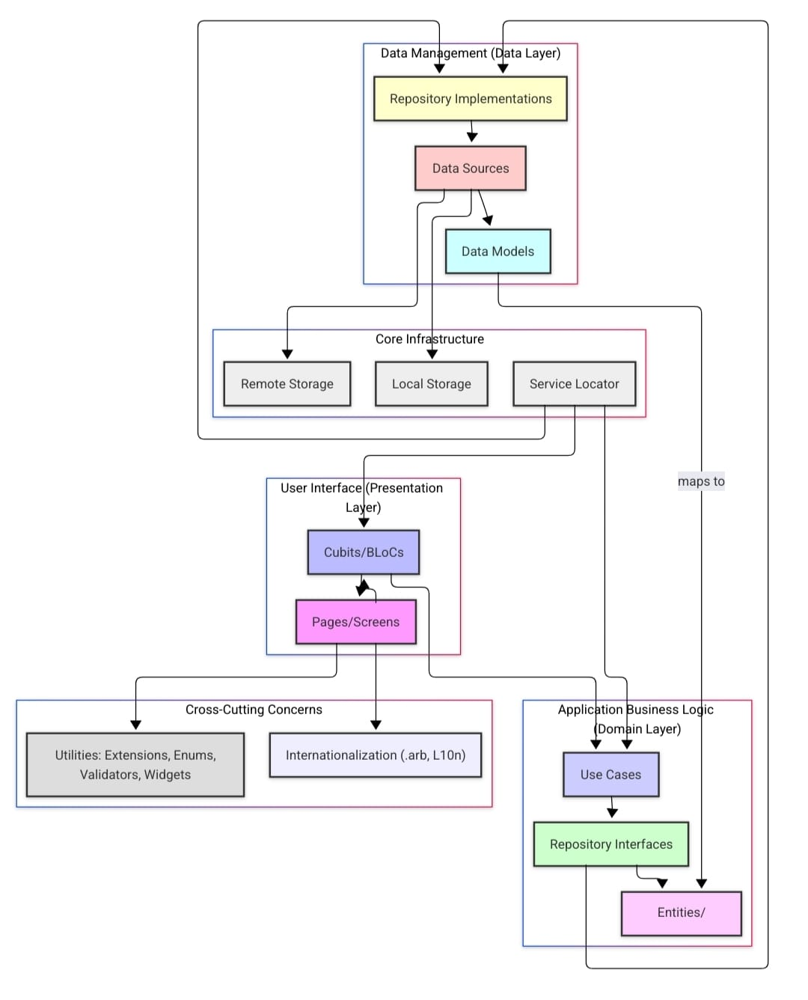

<div align="center">
  <picture> <source srcset="Assets/Svg/white.svg" media="(prefers-color-scheme: dark)" />  </picture>
</div>

# AI-Powered Furniture & Carpentry Mobile Application

## 🎓 Graduation Project 2025

**Zan** is a comprehensive Flutter mobile application developed as a graduation project for **Future Academy - Higher Future Institute for Specialized Technological Studies**. This AI-powered platform integrates furniture e-commerce, carpentry services, and advanced technologies including AR measurement tools and intelligent recommendation systems.

### 📚 Academic Project Details

- **Institution**: Future Academy - Higher Future Institute for Specialized Technological Studies
- **Department**: School of Computer Science
- **Academic Year**: 2024-2025
- **Project Type**: Final Year Graduation Project
- **Supervisor**: Dr. Ibrahim Abd-Allatif
- **Submission Date**: May 2025
- **Project Duration**: 8 months (September 2024 - May 2025)
- **Team Size**: 6 students + 1 supervisor

### 🎯 Project Objectives

- **Primary Goal**: Develop a comprehensive mobile solution for the furniture and carpentry industry
- **Technical Goals**: Implement Clean Architecture, integrate AR/AI technologies, ensure cross-platform compatibility
- **Business Goals**: Address industry fragmentation and improve customer-carpenter connectivity
- **Academic Goals**: Apply software engineering principles and modern development practices

## 📱 Mobile Application Overview

**Zan** is a cross-platform mobile application built with Flutter that addresses the fragmentation in the carpentry and furniture industry by providing a unified platform for customers, carpenters, and service providers.

## 🏗️ Architecture Overview

The application follows **Clean Architecture** principles with a well-structured, scalable design:
<div align="center">
<picture>  

</picture>
</div>

## ✨ Key Features

### 🛍️ Customer Features (Mobile App)

- **Product Browsing**: Browse furniture categories with filtering
- **Search Functionality**: Real-time search with instant results
- **Shopping Cart**: Add, remove, and manage cart items
- **Order Management**: Track order status and history
- **User Profile**: Manage personal information and addresses
- **Favorites**: Save preferred products for later
- **Payment Integration**: Secure payments via Stripe

### 🔧 Service Features (Mobile App)

- **AR Area Measurement**: Real-time room measurement using ARCore
- **AI Recommendation System**: Furniture suggestions based on room photos
- **3D Space Visualization**: View 3D models of furniture
- **Carpenter Services**: Connect with professional carpenters

### 👨‍🔧 Workshop Dashboard (Mobile App)

- **Order Calendar**: Schedule and manage carpenter appointments
- **Analytics Dashboard**: View sales performance and metrics
- **Profile Management**: Manage carpenter profile and services
- **Order Processing**: Handle incoming service orders

## 🛠️ Technical Stack

### Mobile Development Stack

| Technology | Usage | Version |
|------------|-------|---------|
| **Flutter** | Cross-platform mobile development | 3.x |
| **Dart** | Programming language | 3.x |
| **BLoC/Cubit** | State management pattern | ^9.1.0 |
| **GetIt** | Dependency injection | ^8.0.3 |
| **Hive** | Local database storage | ^2.2.3 |
| **Dio** | HTTP client for API calls | ^5.8.0 |
| **Stripe** | Payment processing | ^11.1.0 |
| **ARCore Plugin** | Augmented reality features | ^0.0.9 |
| **Model Viewer** | 3D model visualization | ^1.8.0 |
| **YOLOv8** | AI object detection | Python integration |

### Architecture & Design

- **Clean Architecture**: Three-tier design with clear separation of concerns
- **MVVM Pattern**: Model-View-ViewModel for UI layer
- **Repository Pattern**: Data access abstraction
- **Use Cases**: Business logic encapsulation
- **Material Design 3**: Modern UI/UX guidelines
- **Responsive Design**: Adaptive layouts for all screen sizes

## 🚀 Getting Started

### Prerequisites

- **Flutter SDK**: Version 3.x or higher
- **Dart SDK**: Version 3.x or higher
- **Android Studio** or **VS Code** with Flutter extensions
- **Xcode** (for iOS development)
- **Android SDK**: API level 21 or higher

### Installation

1. **Clone the repository**

   ```bash
   git clone https://github.com/your-username/zan.git
   cd zan
   ```

2. **Install dependencies**

   ```bash
   flutter pub get
   ```

3. **Run the app**

   ```bash
   # For development
   flutter run

   # For release
   flutter run --release
   ```

## 👥 Development Team

- **Samuael Adel Fareed** - Project Lead & Backend Developer
- **Mahmoud Elsayed Khiralla** - Backend Developer
- **Ziad Mohamed Elnagar** - Security & Penetration Testing
- **Maha Abdelmoneam Mohamed** - AI/ML Developer & Computer Vision
- **Ahmed Mohamed Ahmed** - Frontend Developer & Web Interface
- **Felopater Sameh Salama** - Mobile Application Developer (Flutter)
- **Supervisor**: Dr. Ibrahim Abd-Allatif - Academic Supervisor

## 📄 License

This project was developed for academic purposes at **Future Academy - Higher Future Institute for Specialized Technological Studies**, School of Computer Science, May 2025.

---
**Built with ❤️ using Flutter**
